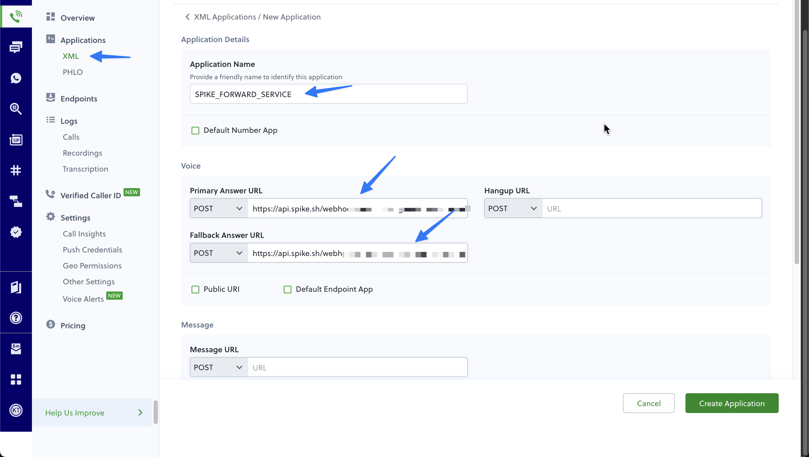
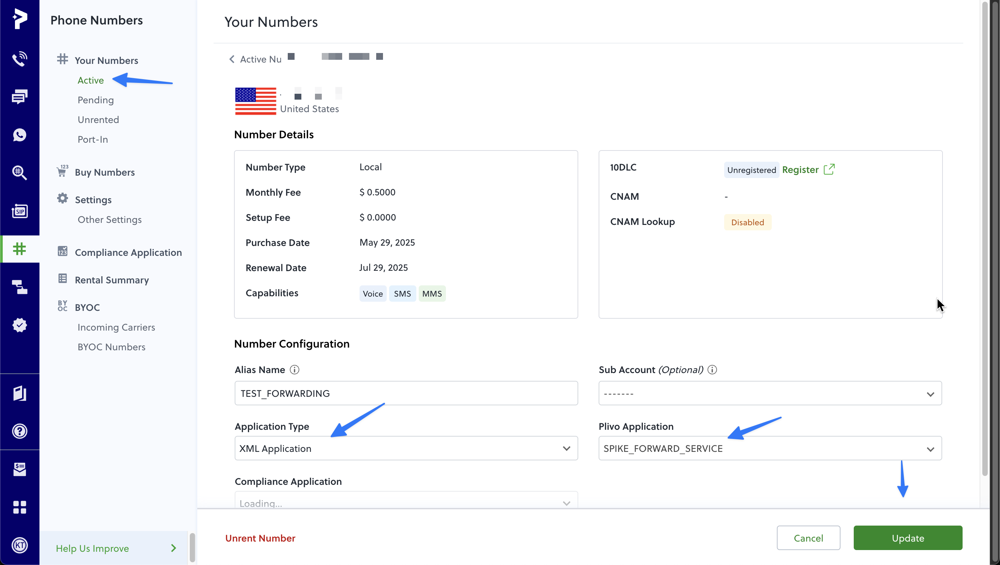

<figure><figcaption></figcaption></figure>

# Configure Your Plivo Number for Live Call Routing
During setting up your Live Call Routing in Spike, you’ll receive a unique **webhook URL**. 

Setting up on Plivo is a multi-step process. On Plivo, you'll be needed to create an XML based application that forwaerds request to Spike and then connect it to your phone number.

Follow these steps:



### 1. **Create an Application**  
In your Plivo Console, go to **Voice → XML under Applications → New Application**.

Give the application a name you can recognise later.

Under the **Voice** section, select POST request and paste Spike's webhook under
- Primary answer URL
- Fallback answer URL
- and Hangup answer URL *(optional)*

Scroll down and hit **Create Application**
<figure><figcaption></figcaption></figure>



### 2. **Configure Phone number**

Visit **Phone Numbers → Active → Select a Number**.

In the Number configuration section on the same page, 
- select **XML Application** under Application Type
- select your previously created application under **Plivo Application**

and hit Update!
<figure><figcaption></figcaption></figure>




That’s it. Once saved, your Plivo number will forward all incoming calls to Spike.  
Spike will handle the routing, fallbacks, and call logging automatically.

---

*If you need help configuring Live Call Routing or integrating your Plivo/Plivo account, reach out to [support@spike.sh](mailto:support@spike.sh).*
