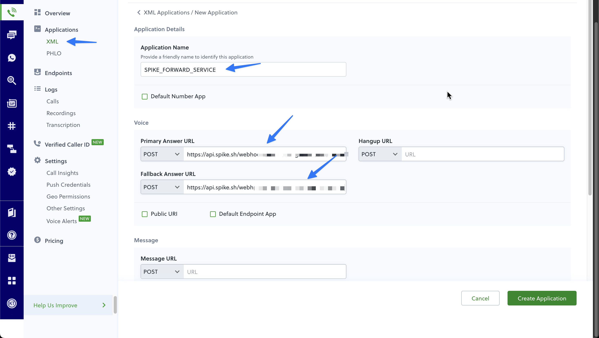
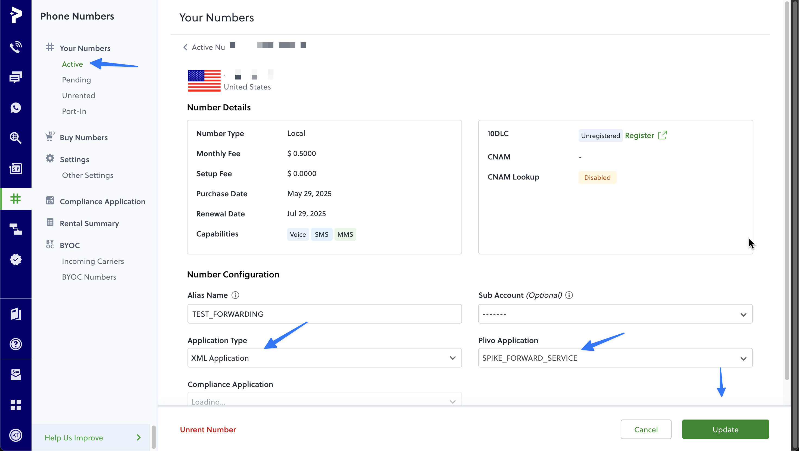

<figure><figcaption></figcaption></figure>

# Configure your Plivo number for Live Call Routing

Spike provides a webhook URL during Live Call Routing setup. Plivo requires you to create an XML application first, then connect it to your phone number.



### Create an application

In your Plivo Console, go to **Voice → XML under Applications → New Application**.

Give the application a name you can recognise later.

Under the **Voice** section, select POST request and paste Spike's webhook URL under:
- Primary answer URL
- Fallback answer URL
- Hangup answer URL (optional)

Click **Create Application**.

<figure><figcaption></figcaption></figure>


### Configure your phone number

Visit **Phone Numbers → Active** and select your number.

In the Number configuration section:
- Select **XML Application** under Application Type
- Select your previously created application under **Plivo Application**

Click **Update**.

<figure><figcaption></figcaption></figure>


### Access call recordings

When call recording is enabled, Spike retrieves recordings directly from your Plivo account.

- In your Plivo Console, go to **Voice → Settings → Other Settings**.
- Under **HTTP Basic Authentication for media access**, select **Disable**.



Once saved, your Plivo number will forward all incoming calls to Spike. Spike handles routing, fallbacks, and call logging automatically.


Need help connecting your Plivo account? Reach out to [support@spike.sh](mailto:support@spike.sh).

