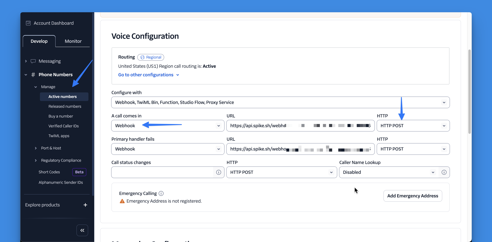

<figure><figcaption></figcaption></figure>

# Configure Your Twilio Number for Live Call Routing
During setting up your Live Call Routing in Spike, you’ll receive a unique **webhook URL**. 
Follow these steps to connect it with Twilio:



### 1. **Sign in to Twilio**  
In your Twilio Console, go to **Develop → Phone Numbers → Manage → Active Numbers**.
If you don't have a phone number, please buy one on Twilio's dashboard.


### 2. **Select your phone number**  
Choose the number you want to use with Live Call Routing.


### 3. **Configure incoming call settings**  
   Scroll down to the **Voice** section.  
   - For **When a call comes in**, select **Webhook** from the dropdown.  
   - Paste your **Spike webhook URL** in the field.  
   - Set the HTTP method to **HTTP POST**.


### 4. **Configure the fallback handler (optional)**  
   In the same section, find **If primary handler fails**.  
   - Select **Webhook** from the dropdown.  
   - Paste the **same Spike webhook URL**.  
   - Set the HTTP method to **HTTP POST**.
   - *Don't forget to save by scrolling down on the same page*



<figure><figcaption></figcaption></figure>

That’s it. Once saved, your Twilio number will forward all incoming calls to Spike.  
Spike will handle the routing, fallbacks, and call logging automatically.

---

*If you need help configuring Live Call Routing or integrating your Twilio/Plivo account, reach out to [support@spike.sh](mailto:support@spike.sh).*
