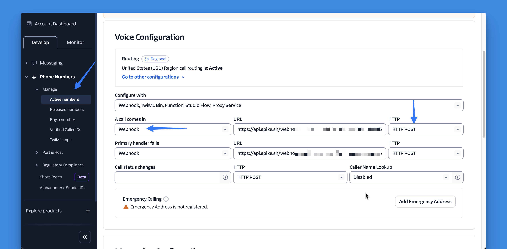

<figure><figcaption></figcaption></figure>

# Configure your Twilio number for Live Call Routing

Spike provides a webhook URL during Live Call Routing setup. Follow these steps to connect it with your Twilio number.



### Sign in to Twilio

In your Twilio Console, go to **Develop → Phone Numbers → Manage → Active Numbers**.
If you don't have a phone number, buy one from the Twilio dashboard first.


### Select your phone number

Choose the number you want to use with Live Call Routing.


### Configure incoming call settings

Scroll down to the **Voice** section.

- For **When a call comes in**, select **Webhook** from the dropdown.
- Paste your **Spike webhook URL** in the field.
- Set the HTTP method to **HTTP POST**.


### Configure the fallback handler (optional)

In the same section, find **If primary handler fails**.

- Select **Webhook** from the dropdown.
- Paste the **same Spike webhook URL**.
- Set the HTTP method to **HTTP POST**.


Save your changes by scrolling to the bottom of the page and clicking Save.



### Access call recordings

When call recording is enabled, Spike retrieves recordings directly from your Twilio account.

- In your Twilio Console, go to **Develop → Voice → Settings → General**.
- Under **HTTP Basic Authentication for media access**, select **Disable**.



<figure><figcaption></figcaption></figure>

Once saved, your Twilio number will forward all incoming calls to Spike. Spike handles routing, fallbacks, and call logging automatically.


Need help connecting your Twilio account? Reach out to [support@spike.sh](mailto:support@spike.sh).

