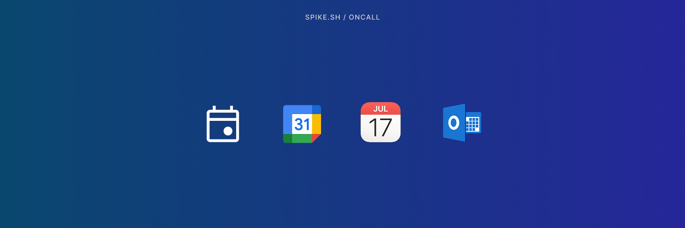

<figure><figcaption></figcaption></figure>

# Add On-call schedule to your calendar

Keep track of your on-call shifts from your favorite calendar app. Spike provides a live subscription link that you can add to Google Calendar, Apple Calendar, Outlook, or any other calendar service that supports calendar subscriptions.

Each link automatically updates whenever your schedule changes, so you always see the latest shifts without downloading any files.

---

## Calendar link options

You can choose what you want to sync:

- **All my shifts across all on-call schedules** – View every upcoming shift you are responsible for, regardless of schedule.

- **My shifts for one on-call schedule**

- **All team members’ shifts in one on-call schedule** – See who is on-call and who will be on-call at any time from your calendar.
---

## How calendar sync works

The calendar link you copy is a Webcal (iCalendar) feed, which many calendar apps can read and update automatically. When your calendar app fetches the feed, Spike provides the latest on-call data for the next six months.

If you make changes to the schedule in Spike, they’ll appear in your calendar the next time your app refreshes the feed. The update interval depends on your calendar app and can vary by provider.

To export your on-call schedule:

1. **Go to your on-call schedule settings** OR **[calendar view of on-calls](https://app.spike.sh/on-calls/calendar)**
2. Click on **Calendar sync**
3. Copy the subscription link or click it directly if your browser offers to open it in your calendar app.

---

#### Works with Any Calendar

<table data-view="cards">
  <thead>
    <tr>
      <th></th>
      <th></th>
      <th data-hidden data-card-target data-type="content-ref"></th>
      <th data-hidden data-card-cover data-type="files"></th>
    </tr>
  </thead>
  <tbody>
    <tr>
      <td><strong>Google Calendar</strong></td>
      <!-- <td>Example description 1.</td> -->
      <td><a href="google-calendar-sync.md">google-calendar-sync.md</a></td>
      <td><a href="../../.gitbook/assets/oncall/calendar-sync/Google Calendar tile.png">Google Calendar tile.png</a></td>
    </tr>
    <tr>
      <td><strong>Apple Calendar</strong></td>
      <!-- <td>Example description 1.</td> -->
      <td><a href="apple-calendar-sync.md">apple-calendar-sync.md</a></td>
      <td><a href="../../.gitbook/assets/oncall/calendar-sync/Apple Calendar tile.png">Apple Calendar tile.png</a></td>
    </tr>
    <tr>
      <td><strong>Microsoft Outlook</strong></td>
      <!-- <td>Example description 1.</td> -->
      <td><a href="microsoft-outlook-sync.md">microsoft-outlook-sync.md</a></td>
      <td><a href="../../.gitbook/assets/oncall/calendar-sync/Outlook Calendar tile.png">Outlook Calendar tile.png</a></td>
    </tr>
  </tbody>
</table>

<!-- <table data-view="cards"><thead><tr><th></th><th></th><th></th><th data-hidden data-card-cover data-type="files"></th><th data-hidden data-card-target data-type="content-ref"></th></tr></thead><tbody><tr><td>Linear</td><td>Connect with Linear to create issues about incidents</td><td></td><td><a href="../../.gitbook/assets/oncall/calendar-sync/Google Calendar tile.png">Google Calendar tile.png</a></td><td><a href="google-calendar-sync.md">google-calendar-sync.md</a></td></tr><tr><td>Google Calendar</td><td></td><td><a href="../../.gitbook/assets/oncall/calendar-sync/Apple Calendar tile.png">Apple Calendar tile.png</a></td><td><a href="apple-calendar-sync.md">apple-calendar-sync.md</a></td></tr><tr><td>Apple Calendar</td><td></td><td><a href="../../.gitbook/assets/oncall/calendar-sync/Outlook Calendar tile.png">Outlook Calendar tile.png</a></td><td><a href="microsoft-outlook-sync.md">microsoft-outlook-sync.md</a></td></tr></tbody></table> -->

The Spike on-call calendar link follows the iCalendar (Webcal) standard.
You can use it with any calendar app that supports subscriptions — including Notion, Proton Calendar, Zoho Calendar, or your preferred calendar tool.

---

## FAQs

<strong>How often does my calendar update?</strong>

Your calendar app decides how often it refreshes the subscription. Spike always serves the latest data when requested.

<strong>Can I share my calendar link with others?</strong>

Yes but remember that sharing it will expose your schedule.

<strong>Does the calendar show past shifts?</strong>

No. The feed only includes upcoming shifts for the next six months.

<strong>What happens if my schedule changes?</strong>

Your subscribed calendar will update automatically the next time it refreshes the feed.

<strong>Can I unsubscribe later?</strong>

Yes. You can remove the subscribed calendar anytime from your calendar app’s settings.

