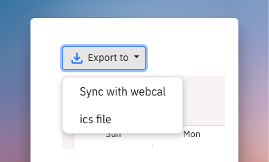

# Add on-call schedule to your calendar

Spike generates a subscription link for your on-call schedule. Add it to Google Calendar, Apple Calendar, Outlook, or any app that supports calendar subscriptions. The link updates automatically when your schedule changes.

<table data-card-size="large"data-view="cards">
  <thead>
    <tr>
      <th></th>
      <th></th>
      <th data-hidden data-card-target data-type="content-ref"></th>
      <th data-hidden data-card-cover data-type="files"></th>
    </tr>
  </thead>
  <tbody>
    <tr>
      <td><strong>Google Calendar</strong></td>
      <td></td>
      <td><a href="google-calendar-sync.md">google-calendar-sync.md</a></td>
      <td><a href="../../.gitbook/assets/oncall/calendar-sync/Google Calendar tile.png">Google Calendar tile.png</a></td>
    </tr>
    <tr>
      <td><strong>Apple Calendar</strong></td>
      <td></td>
      <td><a href="apple-calendar-sync.md">apple-calendar-sync.md</a></td>
      <td><a href="../../.gitbook/assets/oncall/calendar-sync/Apple Calendar tile.png">Apple Calendar tile.png</a></td>
    </tr>
    <tr>
      <td><strong>Microsoft Outlook</strong></td>
      <td></td>
      <td><a href="microsoft-outlook-sync.md">microsoft-outlook-sync.md</a></td>
      <td><a href="../../.gitbook/assets/oncall/calendar-sync/Outlook Calendar tile.png">Google Calendar tile.png</a></td>
    </tr>
  </tbody>
</table>

## Calendar link options

You can choose what to sync:

- **All my shifts across all on-call schedules**: every upcoming shift you are responsible for, regardless of schedule.
- **My shifts for one on-call schedule**: your upcoming shifts in a specific schedule, useful when you're part of multiple schedules.
- **All team members' shifts in one on-call schedule**: see who is on-call and who will be on-call at any time from your calendar.

## How calendar sync works

The subscription link is a Webcal (iCalendar) feed. When your calendar app fetches the feed, Spike provides on-call data for the next six months.

If you make changes to the schedule in Spike, they'll appear in your calendar the next time your app refreshes the feed. The update interval depends on your calendar app and can vary by provider.

To set up calendar sync:

1. Go to your on-call schedule settings or the [calendar view of on-calls](https://app.spike.sh/on-calls/calendar).
2. Click **Calendar sync**.
3. Copy the subscription link, or click it directly if your browser offers to open it in your calendar app.

<figure><figcaption>
Copy the subscription link from your on-call schedule settings.
</figcaption></figure>

## Works with any calendar

The subscription link follows the iCalendar (Webcal) standard. It works with any calendar app that supports subscriptions, including Notion, Proton Calendar, Zoho Calendar, or your preferred calendar tool.

## FAQs

### How often does my calendar update?

Your calendar app decides how often it refreshes the subscription. Spike always serves the latest data when requested.

### Can I share my calendar link with others?

Yes, but sharing it will expose your schedule to whoever has the link.

### Does the calendar show past shifts?

No. The feed only includes upcoming shifts for the next six months.

### What happens if my schedule changes?

Your subscribed calendar will update the next time your app refreshes the feed.

### Can I unsubscribe later?

Yes. Remove the subscribed calendar anytime from your calendar app's settings.
