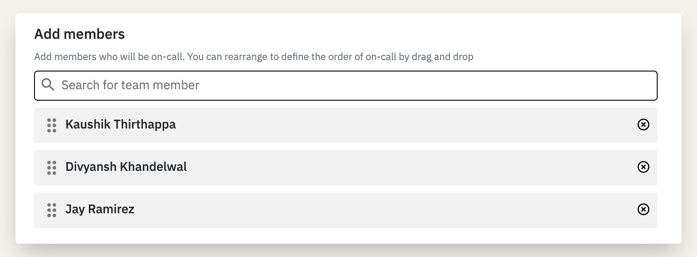
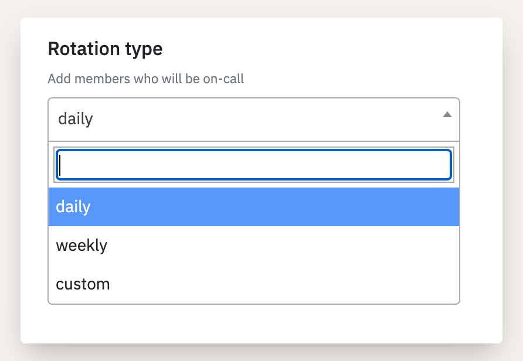
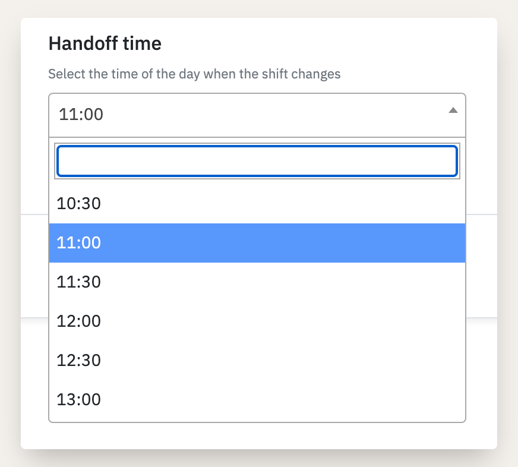
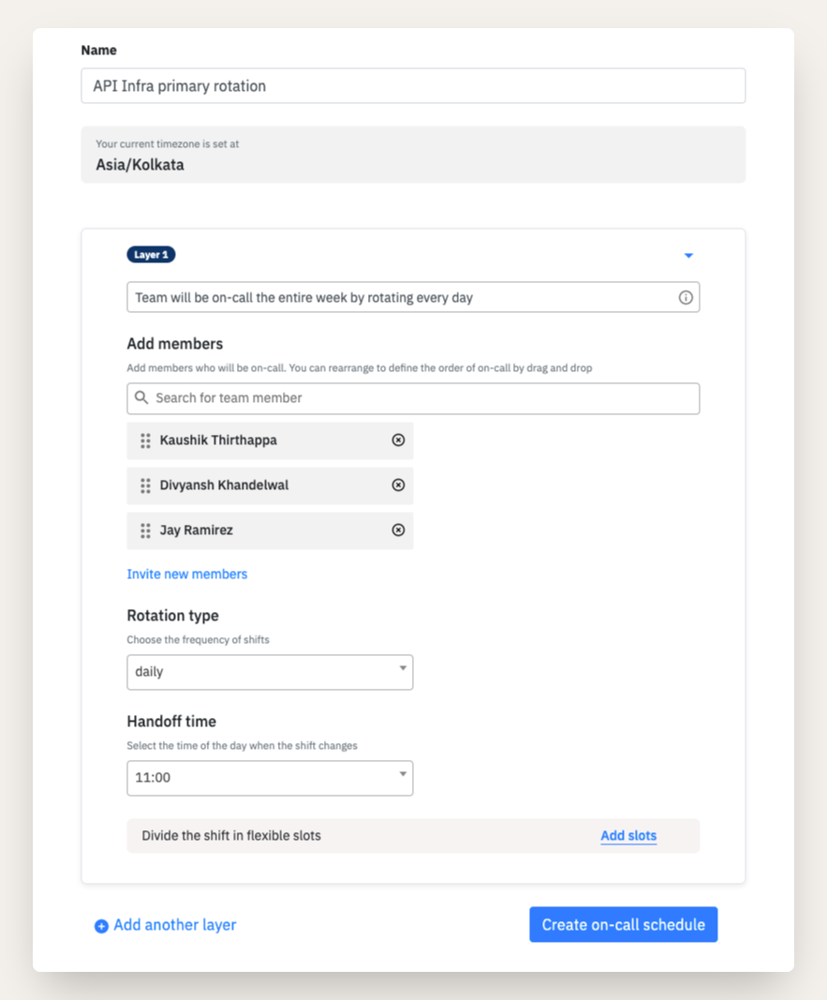
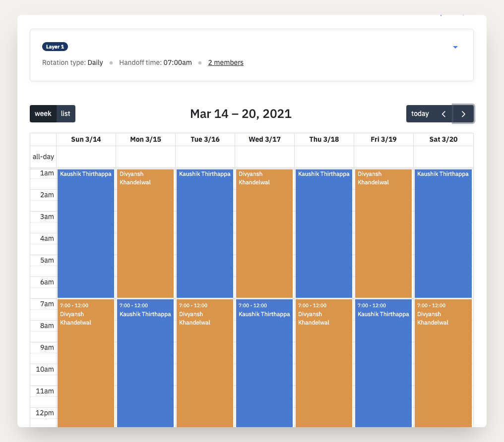

# Create On-call schedule

## Key components

A simple on-call schedule comprises of layers (_we will get into this on the next page_) and each layer will have the below components

1. **Team members** who will be on-call
2. **Rotation** determines the duration of an on-call shift
3. **Handoff** is the time when the shift rotates
4. **Slots** to break a shift into times of day/week that works for you

## Creating a schedule

On-call section is situated on the navbar of your dashboard.&#x20;

.png>)

.png>)

Head over to On-call section in the header and click schedules and then **New schedule**

### Let's create our first on-call schedule

#### **Step 1: Add members**&#x20;

Should be at least one member. The order of members is the order of members going on-call one at a time.&#x20;


You can choose re-arrange the sequence of members while creating or editing


#### **Step 2: Select rotation -**&#x20;

Choose a rotation type that works for your team.&#x20;

#### ****

#### **Step 3: Add handoff time**

Handoff time is the time of day when previous person's on-call time ends and the next person's begins.

This is how our daily rotational oncall form would look like -&#x20;

The above on-call schedule has 2 members, rotates daily and the shift changes at 11:00 AM everyday. This also means our team members will be on-call for 24 hours straight. &#x20;

The calendar will give you a perfect understanding of who's on-call at a given date. You can choose to navigate and plan your dates accordingly too.&#x20;

## Using the schedule in an escalation policy

Creating a schedule means nothing if you alerts are not being send to the one who is on-call. To do so, head over to your escalation policy and choose to either create one or edit an existing escalation policy.&#x20;

.png>)

You can choose to add Schedule just like you would any user to a policy with the alert channel.&#x20;


Once added, you can treat the schedules just like users and add them at any step in escalation policy. However, we would recommend adding them in the first step so as to route the alerts directly to the on-call person.

