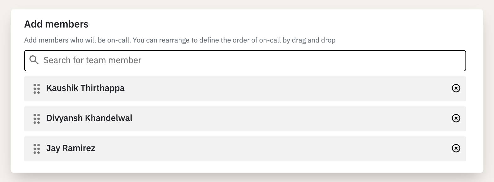
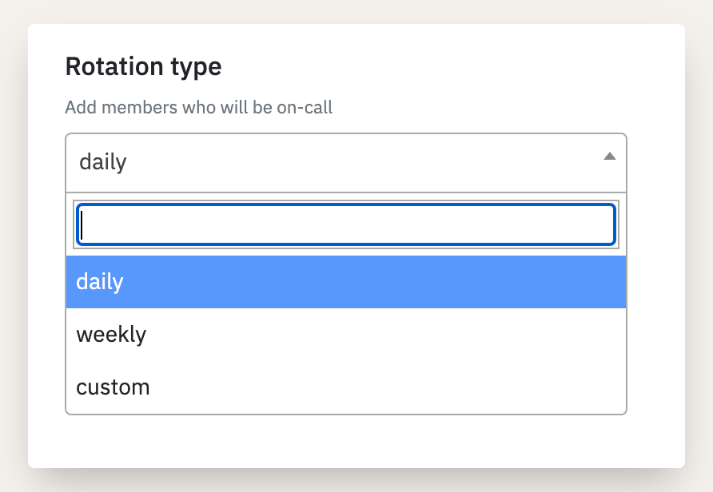
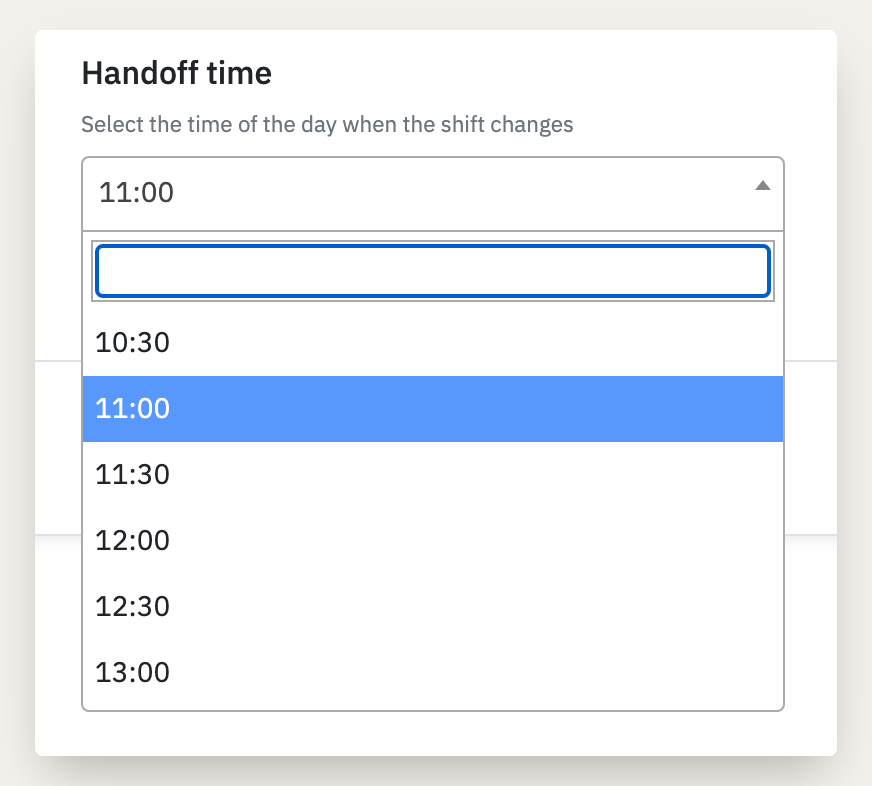
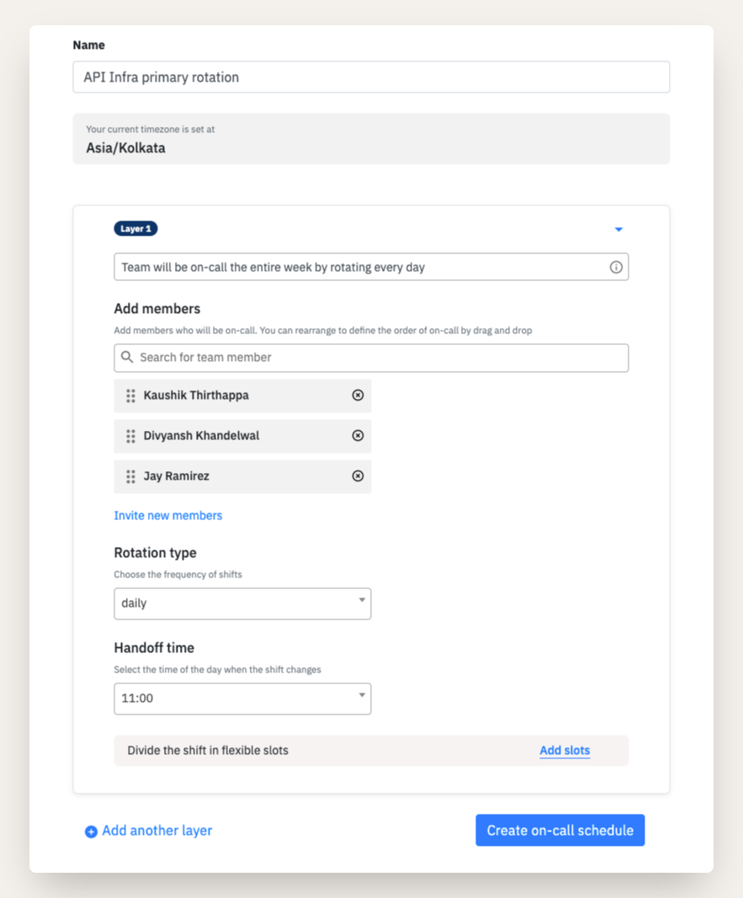
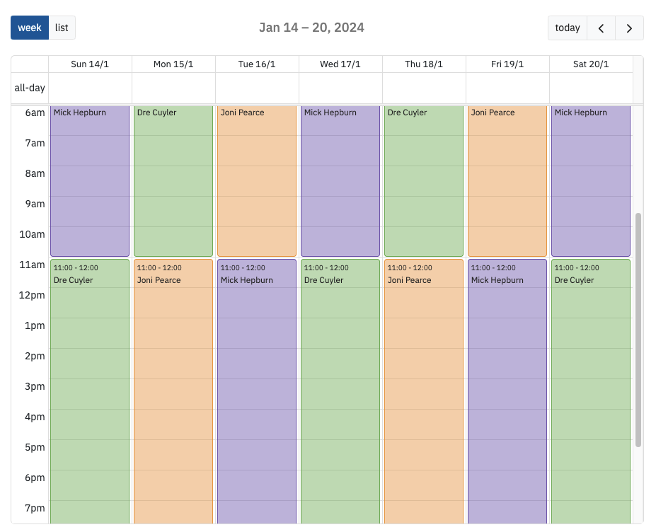

# Create an on-call schedule

## Key components

Every on-call schedule is built from layers (covered on the next page). Each layer has four components:

1. **Team members**: the people who will be on-call
2. **Rotation**: how long each on-call shift lasts
3. **Handoff**: the time of day when the shift rotates to the next person
4. **Slots**: optional time windows within a shift (covered separately)

## Create a schedule


Not sure where to start? Spike offers [on-call templates](https://spike.sh/templates/oncall-templates) with pre-built schedule configurations.


Go to the [On-call section](https://app.spike.sh/on-calls) and click **New schedule**.

<figure><figcaption></figcaption></figure>

### Step 1. Add members

Add at least one member. The order determines the rotation sequence. The first member goes on-call first.


Use the live preview calendar while creating the schedule to see how the rotation looks.


<figure><figcaption></figcaption></figure>

You can rearrange the member order at any time, including while editing an existing schedule.



### Step 2. Select rotation

Choose a rotation type that works for your team.

<figure><figcaption></figcaption></figure>

### Step 3. Set handoff time

Handoff time is when the current person's shift ends and the next person's begins.

<figure><figcaption></figcaption></figure>

Here's what a completed daily rotation schedule looks like: 2 members, rotating daily, with handoff at 11:00 AM. Each member is on-call for 24 hours at a time.

<figure><figcaption></figcaption></figure>

The calendar shows who's on-call at any given time. Use it to plan coverage across upcoming dates.

<figure><figcaption></figcaption></figure>

## Add to an escalation policy

A schedule only works if it's added to an [escalation policy](../escalations/introduction-to-escalations.md). Without this, alerts won't route to the person who's on-call.

Add the schedule to your escalation policy the same way you'd add any team member. You can add it at any step in the policy.

<figure><figcaption>
On-call schedule added to an escalation policy.
</figcaption></figure>


Add the schedule at the first step of your escalation policy to route alerts directly to whoever is on-call.

