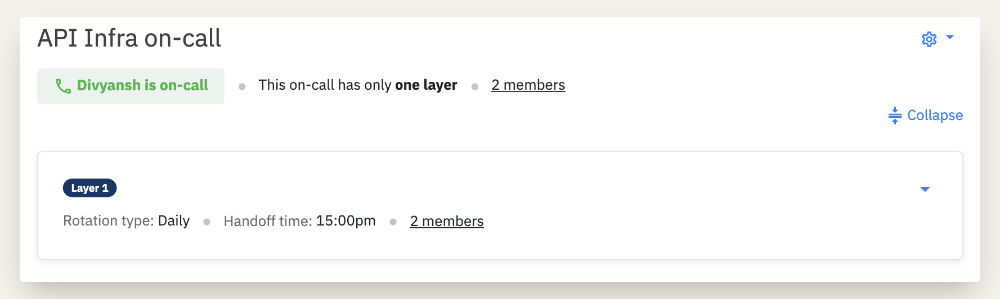
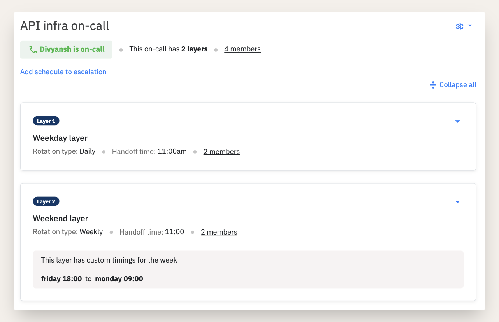

# Layers in on-call schedules

## What are Layers in on-call schedules?

In Spike.sh's on-call scheduling, 'Layers' add a dynamic dimension to your planning. Each layer encompasses essential elements like members, handoff times, rotations, and slots. The flexibility of adding multiple layers to a single schedule empowers you to customize timings and team involvement with precision.

Layers are meticulously organized in a sequential, ascending order. This design means that in instances of overlapping schedules, the higher layer takes precedence. For example, if Layer 2's timing intersects with that of Layer 1, Layer 2 will be the active layer, overriding Layer 1. Similarly, in a configuration with three layers, Layer 3 would supersede both Layers 1 and 2 in overlapping scenarios.

This layered approach ensures a seamless, well-coordinated on-call schedule, allowing for nuanced control over who is on-call and when..&#x20;


Every on-call schedule will have at least one layer.


### What does overlapping mean?

'Overlapping' in layered scheduling is straightforward: when two layers share common times, the higher layer takes precedence. To illustrate, if Layer 1 and Layer 2 have overlapping schedules, Layer 2 will be the active one, effectively overriding the schedules set in Layer 1.

### Understand layers with an example

Here is a simple on-call schedule with 2 members rotating each day. This means one of the members is on-call every day covering for the entire week.&#x20;

**All days -** Daily rotation among 2 members&#x20;

This is how the calendar looks like with just the above layer in our on-call schedule

### Adding the weekend layer to override

Now, this could be too much to handle. How about we give them a break over the weekend and ask other members to help out.&#x20;

To enable this, we can add another layer with weekly rotation among members who only need to be on-call **from Friday 6 PM to Monday 9 AM**

**Weekdays -** Daily rotation among 2 members \
**Weekends** - One person for the entire weekend rotating weekly

Members from Layer 1 will be on-call every alternate day, on all weekdays and members from Layer 2 will be on-call for the entire alternate weekend (since weekly rotation has been applied).&#x20;

This is how the calendar looks with both layers.&#x20;

.png>)

### **How did overlapping work here?**

Members from Layer 2 will overlap the scheduled on-call from Friday 6 PM to Monday 9 AM.&#x20;


If the weekend layer was Layer 1 and the weekday layer was Layer 2 then the weekend layer would have never come to effect. **There are no limits on number of layers to be added on a single on-call schedule**


You can start experimenting with layers by editing the same schedule as many times as you want.&#x20;

### FAQs on Layers

* **Can I add a layer temporarily?**
  * Yes, you can. Alternatively, also check out [On-call overrides](https://docs.spike.sh/oncall-schedules/override-an-on-call).&#x20;
* **How many layers can I add?**
  * There is no limitation. Our recommendation is to avoid adding too many layers. It could get confusing how the schedule works and as a result teams usually hesitate to delete any layer.&#x20;
* **How many members can be added in one layer?**
  * There is no limit here either.&#x20;

