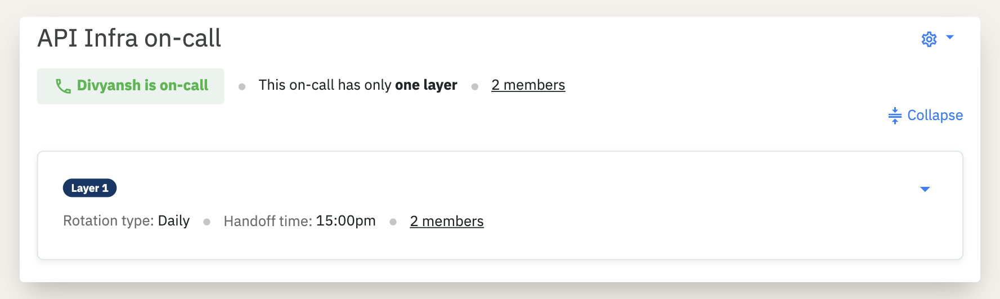
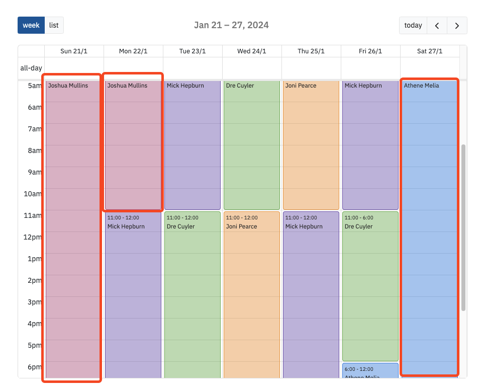
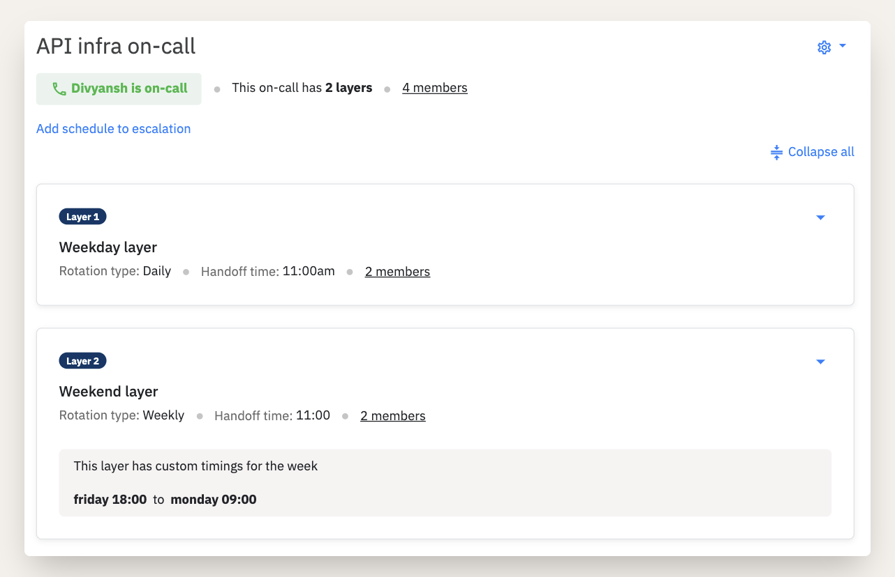

# Layers in on-call schedules

Each on-call schedule can have one or more layers. Every layer has its own members, rotation, handoff times, and slots. When two layers overlap, the higher-numbered layer takes over.

## Example: weekday and weekend coverage

This example has two layers:

- **Layer 1:** Daily rotation among 2 members, covering all days
- **Layer 2:** One person on-call each weekend, rotating weekly from Friday 6 PM to Monday 9 AM

Layer 1 is the base. One of the two members is on-call every day of the week.

<figure><figcaption>
Layer 1: daily rotation among 2 members.
</figcaption></figure>

<figure><figcaption>
Calendar view with Layer 1 only.
</figcaption></figure>

Layer 2 covers weekends only. It runs from Friday 6 PM to Monday 9 AM with a weekly rotation.

<figure><figcaption>
Two layers: Layer 1 for weekdays, Layer 2 for weekends.
</figcaption></figure>

<figure><figcaption>
Calendar with both layers: weekday and weekend coverage.
</figcaption></figure>

Layer 2 was added so the members rotating on Layer 1 get a break over the weekend. Layer 2 overrides Layer 1 from Friday 6 PM to Monday 9 AM.

## How layers work

Layers are ordered sequentially. When two layers share overlapping time windows, the higher layer overrides the lower one. If Layer 1 and Layer 2 overlap, Layer 2 is active during that window. In a three-layer schedule, Layer 3 overrides both Layer 1 and Layer 2 wherever they overlap.


Layer order matters. If your weekend layer is Layer 1 and your weekday layer is Layer 2, the weekend layer will never take effect because Layer 2 always takes precedence. There is no limit on the number of layers in a single schedule.


## FAQs

### Can I add a layer temporarily?

Yes. You can also use [on-call overrides](override-an-on-call.md) for short-term coverage changes.

### How many layers can I add?

There is no limit. That said, too many layers can make the schedule hard to follow.

### How many members can be added in one layer?

There is no limit.
