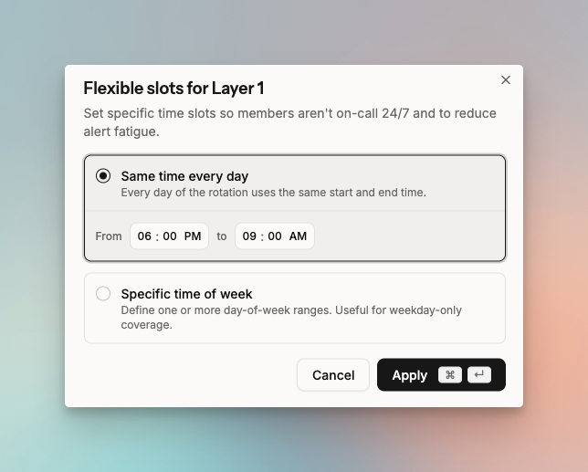
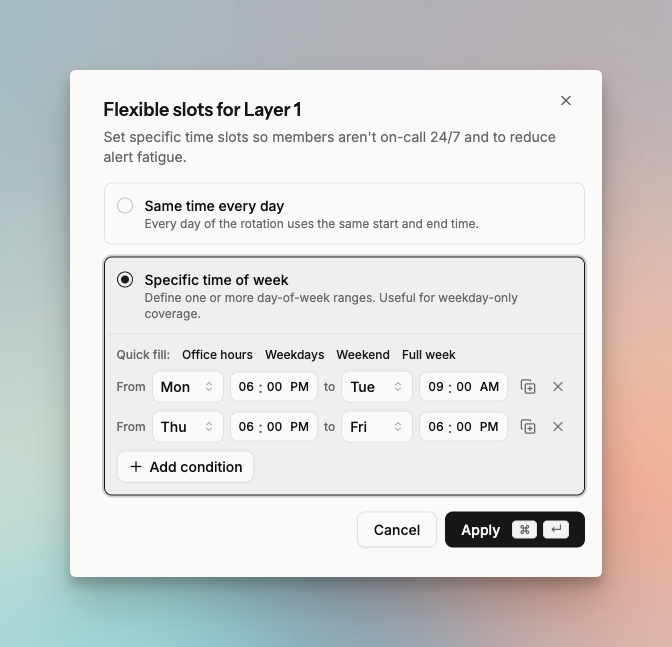
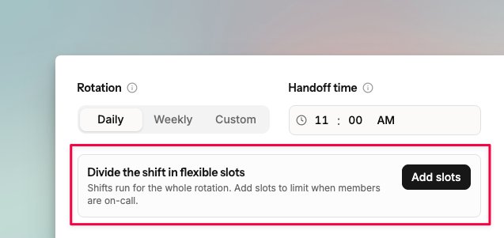

# Slots in schedules

Slots define specific windows within an on-call shift. Members are only alerted during the hours you configure. You can apply different slots to different layers.

There are two types:

- **Time of day**: limit on-call to certain hours each day
- **Days of week**: limit on-call to specific days and hours

## Slots for specific times of day

Members are on-call only during the hours you set. In the example below, the member is on-call from 6 PM to 9 AM every day for Layer 1.

<figure><figcaption>
On-call from 6 PM to 9 AM every day.
</figcaption></figure>

## Slots for specific times and days of week

Members are on-call only on the days and hours you set. In the example below, members are on-call every Monday 6 PM to Tuesday 9 AM, and Thursday 6 PM to Friday 6 PM, for Layer 1.

<figure><figcaption>
On-call Monday 6 PM to Tuesday 9 AM, and Thursday 6 PM to Friday 6 PM.
</figcaption></figure>

## How to add slots

While creating or editing an on-call schedule, find the option to add slots in each layer. Slots added to a layer affect the entire on-call schedule.

<figure><figcaption>
Add slots on each layer.
</figcaption></figure>

## Use cases

**Time of day slots:**

- Non-office hours coverage: e.g. 6 PM to 9 AM daily.
- Split coverage across layers: 12 AM to 8 AM for Layer 1, 8 AM to 4 PM for Layer 2, 4 PM to 12 AM for Layer 3. This rotates 8-hour duties across members daily or weekly.

**Days of week slots:**

- Weekdays only: Monday 9 AM to Friday 6 PM.
- Skip a maintenance day: use multiple slots to exclude a specific day. To exclude Thursday, set Monday 9 AM to Thursday 12 AM, then Friday 12 AM to Monday 9 AM.


Avoid overlapping time windows across slots. If one slot runs Monday 9 AM to Thursday 9 AM and another runs Tuesday 9 AM to Friday 9 AM, Tuesday and Wednesday are covered by both. This causes unexpected behavior.

