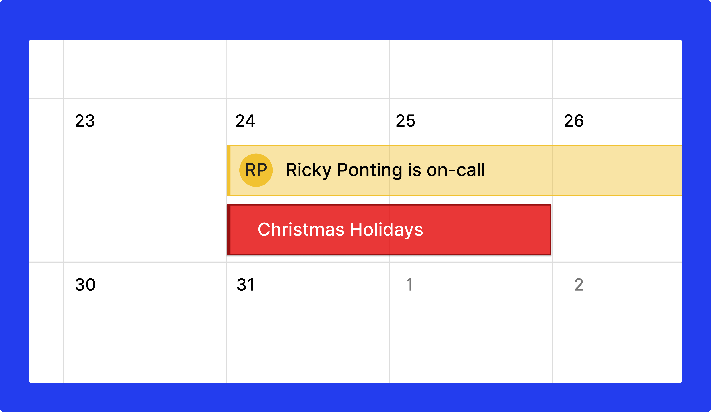
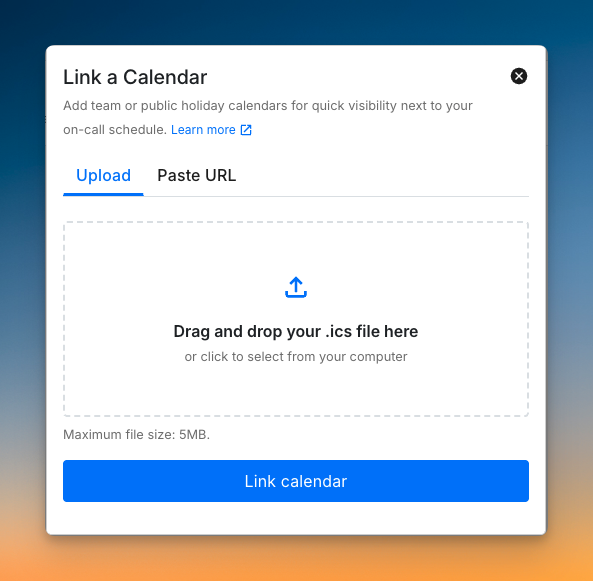

<figure><figcaption></figcaption></figure>

# Linked calendars

Linked calendars display external or holiday calendars as overlays on your on-call schedule. Use them to plan shifts around holidays, regional events, or company-wide leaves. They do not modify or affect any existing on-call shifts.

<figure><figcaption>
A holiday calendar overlaid on the on-call schedule.
</figcaption></figure>

## Adding a linked calendar

Visit the [Linked Calendars](https://app.spike.sh/oncalls/linked-calendars) section on your dashboard. You can upload an `.ics` file or link directly from Google Calendar or Outlook.

<figure><figcaption>
Link a calendar from the Linked Calendars section.
</figcaption></figure>



1. Export your calendar as a `.ics` file from Google, Outlook, or another calendar app.
2. In the Linked Calendars section, click **+ Link a calendar** and choose **Upload file**.
3. Select your `.ics` file and click **Link**.

The imported calendar appears as an overlay. Toggle visibility anytime using the checkbox beside its name.


1. In Google Calendar, go to **Settings → Integrate calendar**.
2. Copy the **Public address in iCal format**. The calendar must be set to public.
3. In the Linked Calendars section, click **Link calendar**, choose **From link**, and paste the link.


1. In Outlook Calendar, go to **Settings → View all Outlook settings → Calendar → Shared calendars**.
2. Under **Publish a calendar**, select the calendar and permissions, then copy the ICS link.
3. In the Linked Calendars section, click **Link calendar**, choose **From link**, and paste the link.




Spike only reads data from linked calendars. It cannot write, modify, or delete any events on external calendars.


## Managing linked calendars

All linked calendars appear in the [Linked Calendars list](https://app.spike.sh/oncalls/linked-calendars) below your on-call calendar.

- **Toggle on/off:** Use the checkbox beside a calendar name to show or hide it on the on-call view.
- **Refresh data:** Click **Refresh** beside a calendar to fetch the latest events. Spike refreshes all calendars automatically every 24 hours at midnight UTC.

Only users who can modify on-call schedules can add, delete, or manage linked calendars.


Linked calendars are shared across the team. Toggling visibility, adding, and deleting linked calendars affects everyone's view.


## FAQs

### Can I link multiple calendars?

Yes. All linked calendars appear as overlays on your on-call calendar.

### Does linking a calendar change my on-call schedule?

No. Linked calendars are for reference only and do not modify or offset any on-call shifts.

### How often do linked calendars refresh?

Calendars added via public links refresh automatically every 24 hours at midnight UTC. You can also refresh manually anytime by clicking **Refresh** beside the calendar name.

### Who can add or manage linked calendars?

Anyone with permission to modify on-call schedules can add, delete, or manage linked calendars.

### Can I hide a calendar without deleting it?

Yes. Toggle visibility on or off using the checkbox beside each calendar. The change applies to everyone in the workspace.
