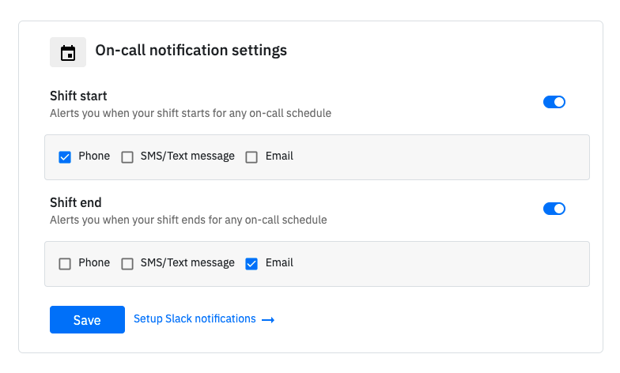

# Notifications for on-call shifts

## Notifications for on-call shifts

Currently, we support alerts across all on-call schedules. It's a great way to stay updated when your on-call shift starts. Available channels for notifications are Phone call, SMS, Email, and Slack.

### When your shift starts/ends

You can choose to get alerts over **Phone calls, SMS, and Email** when your shift starts or ends. Visit [On-call notifications in settings](https://app.spike.sh/settings#oncall-notifications) and enable alerts separately for Shift start and Shift end. Once saved, you would get notifications for any on-call schedules you are part of.

### When any member of your team starts/ends on-call shift

You can set up Slack notifications when anyone of your team starts and ends a shift across all on-call schedules. Visit [Slack settings](https://app.spike.sh/settings/organisation#slack) and set up channels you would like to receive notifications on. Once saved, all members in selected Slack channels will receive updates on shift start and end.

