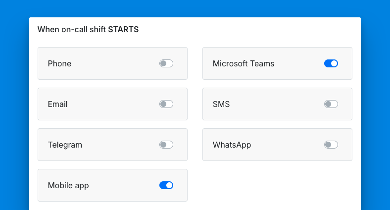
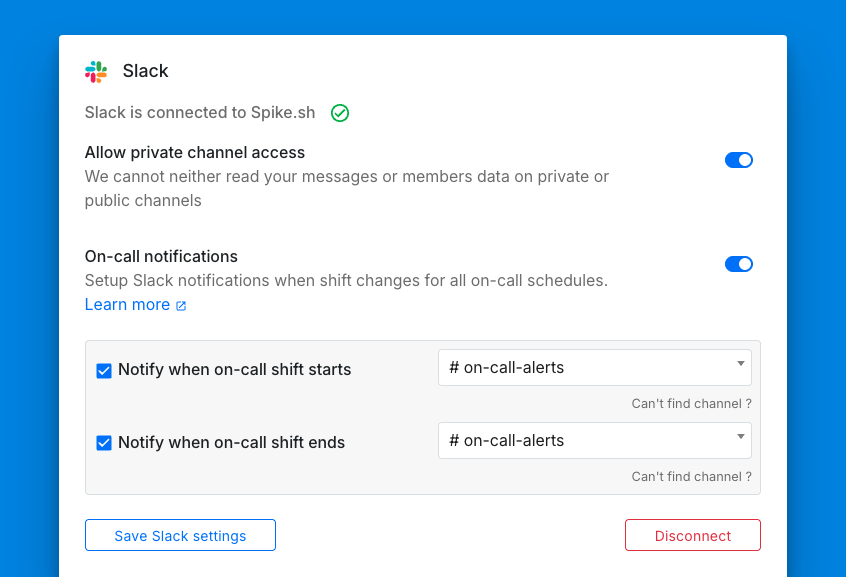
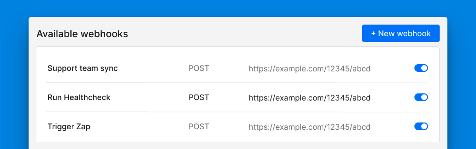

<figure><figcaption></figcaption></figure>

# Notifications for on-call shifts

Spike notifies you when your on-call shift starts or ends. Personal notifications go directly to you. Team notifications go to shared channels like Slack, Teams, and Discord.

## Personal notifications

<figure><figcaption><p>Personal notification settings for shift start and end.</p></figcaption></figure>

Spike sends personal notifications via phone call, SMS, WhatsApp, Telegram, and Email when your shift starts or ends.

To enable:

1. Visit [On-call notifications in settings](https://app.spike.sh/settings/personal-on-call).
2. Enable notifications separately for **Shift Start** and **Shift End**.
3. Once saved, the settings apply to all on-call schedules you are part of.


You can override these per schedule. Visit **On-call > Settings > My alerts**.


## Team notifications

<figure><figcaption><p>Slack notifications when any team member's shift starts or ends.</p></figcaption></figure>

Spike notifies a shared channel when any team member starts or ends their shift. This works with Slack, Microsoft Teams, and Discord.

To enable:

1. Visit [Slack settings under Organisation > Alerts](https://app.spike.sh/settings/general/alerts).
2. Select one or more channels to receive notifications.
3. Once saved, all members in the selected channels receive shift start and end updates.

Similar settings are available for Microsoft Teams and Discord.


Slack and Microsoft Teams notifications can be overridden per schedule under the schedule's settings.


## Webhook trigger on shift rotations

<figure><figcaption><p>Webhook payloads for shift start and end events.</p></figcaption></figure>

Configure outbound webhooks to trigger on shift rotations using POST, PUT, or GET requests. Spike sends a webhook each time a shift starts or ends, with a separate request for each event.

If one shift ends and another begins immediately, Spike triggers both the end and start webhooks in quick succession. Each has its own payload.

The webhook payload includes details about the on-call schedule and the shift member.



```
{
  "event_type": "oncall_shift_start", <---- EVENT DIFFERS
  "organization": {
    "id": "65f15fd64171a1487c4fe666",
    "name": "spike"
  },
  "user": {
    "id": "660bb3f8324701c2f2e24c98",
    "firstName": "John",
    "lastName": "Doe",
    "email": "johndoe@example.com"
  },
  "oncall": {
    "id": "67a20db2c9f79829b51fbf80",
    "name": "Weekday after office hours rotation",
    "url": "https://app.spike.sh/on-calls/67a20db2c9f79829b51fbf80", <-- permalink
    "shift": {
      "id": "67f3c5e9f6dd8715782cc7b2",
      "start": "2025-05-26T10:23:20.294Z", <-- times in UTC
      "end": "2025-05-26T18:30:00.000Z"
    }
  }
}
```



```
{
  "event_type": "oncall_shift_end", <---- EVENT DIFFERS
  "organization": {
    "id": "65f15fd64171a1487c4fe666",
    "name": "spike"
  },
  "user": {
    "id": "660bb3f8324701c2f2e24c98",
    "firstName": "John",
    "lastName": "Doe",
    "email": "johndoe@example.com"
  },
  "oncall": {
    "id": "67a20db2c9f79829b51fbf80",
    "name": "Weekday after office hours rotation",
    "url": "https://app.spike.sh/on-calls/67a20db2c9f79829b51fbf80", <-- permalink
    "shift": {
      "id": "67f3c5e9f6dd8715782cc7b2",
      "start": "2025-05-26T10:23:20.294Z", <-- times in UTC
      "end": "2025-05-26T18:30:00.000Z"
    }
  }
}
```



## FAQs

### Can I receive on-call shift notifications via multiple channels?

Yes. You can enable phone calls, SMS, WhatsApp, Telegram, and Email for personal notifications. Team notifications can go to Slack, Microsoft Teams, and Discord simultaneously.

### Are on-call notifications available on all plans?

Yes, on-call notifications are available on all plans.

### Can I disable notifications for a specific on-call schedule?

Yes. Visit **On-call > Settings > My alerts** to override notification settings per schedule.

### Do on-call notifications count toward my monthly alert quota?

Yes. For plans with a monthly alert limit, on-call shift notifications count toward that quota.
