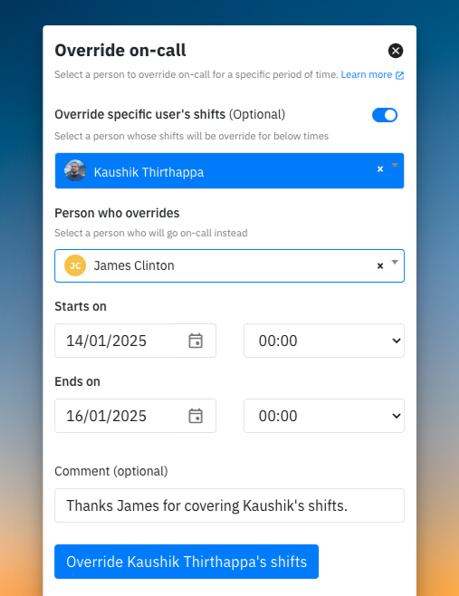
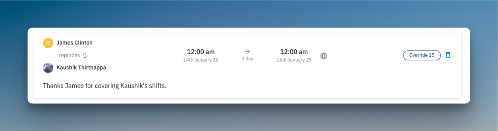
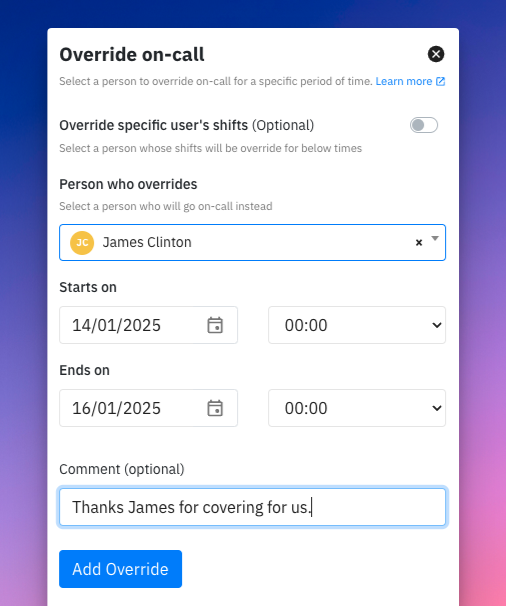
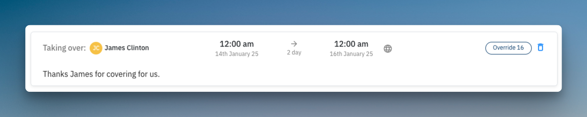

# On-call overrides

<figure><figcaption></figcaption></figure>

## Introduction
On-call overrides give your team flexibility by allowing temporary adjustments to your schedule without permanently changing it. Whether you're stepping out for a dentist appointment or taking a well-deserved break after a hectic week, overrides help ensure that incident coverage continues seamlessly. Overrides are non-recurring and ideal for short-term coverage.


Overrides are temporary and do not repeat like regular schedules, simplifying one-time changes to your on-call coverage.


## Adding an override

You can create overrides for a specific user's shift or for the entire duration between a start and end time. Here’s how to set it up:



* From your [on-call schedule](https://app.spike.sh/on-calls), press `O` or click on `Override`.
* Add the name of the team member, the start and end time, and an optional comment for context.
* **Save**: The override will be applied, and the selected member will temporarily take over on-call responsibilities.





Example: In the screenshot below, James has been assigned an override to cover Kaushik's shifts from January 14th to January 16th at midnight. The comment provides clarity about the reason for the override.

<figure><figcaption></figcaption></figure>
<figure><figcaption></figcaption></figure>


Example: In the screenshot below, James has been assigned an override to cover **everyone's** shifts from January 14th to January 16th at midnight. The comment provides clarity about the reason for the override.

<figure><figcaption></figcaption></figure>

<figure><figcaption></figcaption></figure>



## FAQs

Can I add multiple overrides for the same time period?

Yes, you can. If overrides overlap, the most recently added override will take precedence.

Can I override the schedule for multiple team members at once?

No, each override is specific to one user and covers their shift or a time period. Multiple overrides must be added individually.

Are notifications sent when an override is added or removed?

Yes, team members affected by the override will receive notifications about the change.

Who can add or remove overrides?
 
Anyone who is not assigned a "Viewer" role in your team can add and delete overrides. This permission is fixed and cannot be customized. 

