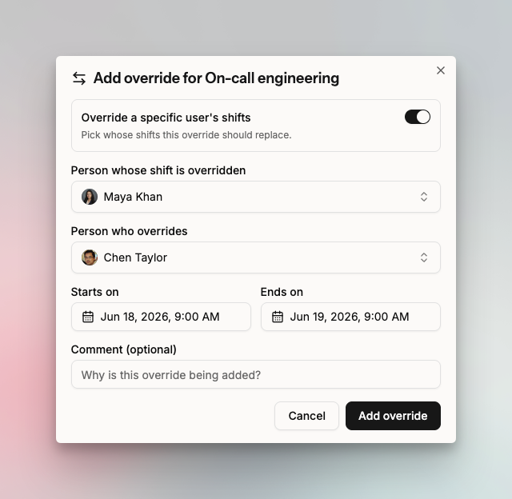
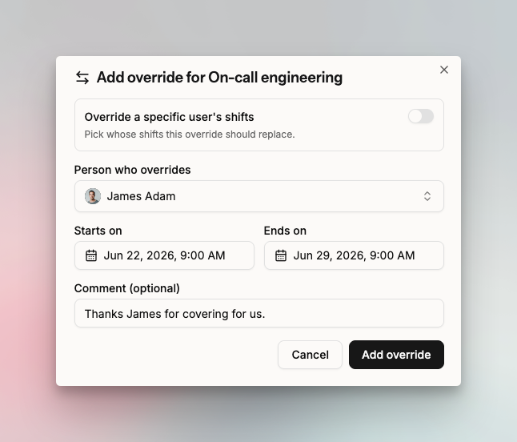

# On-call overrides

<figure><figcaption></figcaption></figure>

Overrides are one-time, non-recurring adjustments. Use them when someone needs short-term coverage without altering the schedule itself.

## Adding an override

From your [on-call schedule](https://app.spike.sh/on-calls), press `O` or click **Override**. Add the team member's name, start and end time, and an optional comment for context. Save to apply.

There are two ways to use overrides:



The override replaces a specific member's on-call time. In the example below, Chen Taylor covers Maya Khan's shift from June 18th, 2026 (9:00 AM) to June 19, 2026 (9:00 AM).

<figure><figcaption></figcaption></figure>


The override takes over all on-call responsibilities for the selected time window. In the example below, James covers everyone's shifts from June 22nd, 2026 (9:00 AM) to June 29th, 2026 (9:00 AM).

<figure><figcaption></figcaption></figure>



## FAQs

### Can I add multiple overrides for the same time period?

Yes. If overrides overlap, the most recently added override takes precedence.

### Can I override the schedule for multiple team members at once?

No. Each override covers one user. Add separate overrides for each member you want to cover.

### Are notifications sent when an override is added or removed?

Yes. Team members involved in the override receive notifications about the change.

### Who can add or remove overrides?

Anyone without a Viewer role can add and delete overrides. This permission is fixed and cannot be customized.
