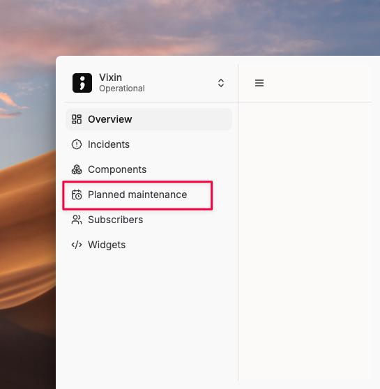
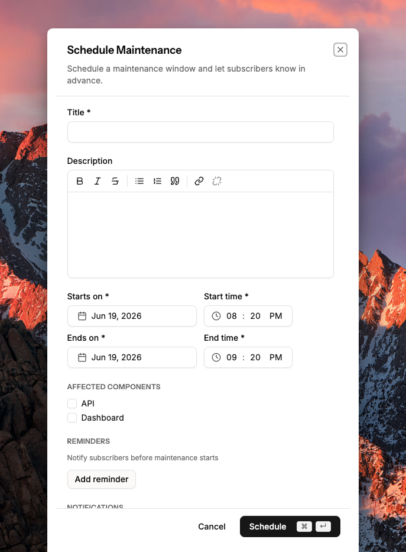
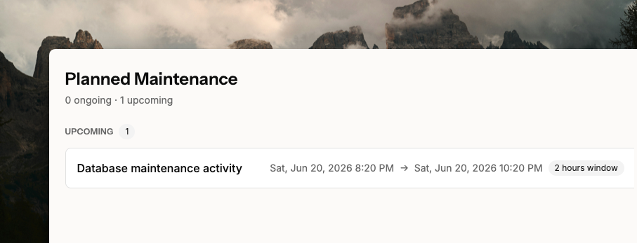
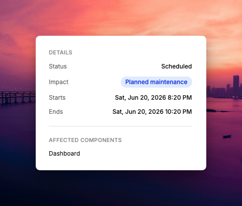

# Create planned maintenance on your status page

Planned maintenance events let you communicate scheduled downtime or service impacts to your customers before they happen.

## Create a maintenance event

Click **Planned maintenance** from the left sidebar.

<figure><figcaption></figcaption></figure>

Click **Schedule maintenance** and fill in the details.

<figure><figcaption></figcaption></figure>

Add a **title** and **description** to explain the maintenance. Select the **affected components** — for example, a database maintenance may affect the API but not the website. Set the **start** and **end** date and time.

You can set **reminders** to notify subscribers before maintenance starts, and configure **notifications** to alert them when it begins and ends.

## View upcoming maintenance

Once scheduled, the event appears in the **Upcoming** section.

<figure><figcaption></figcaption></figure>

Click the event to see its full details.

<figure><figcaption></figcaption></figure>
