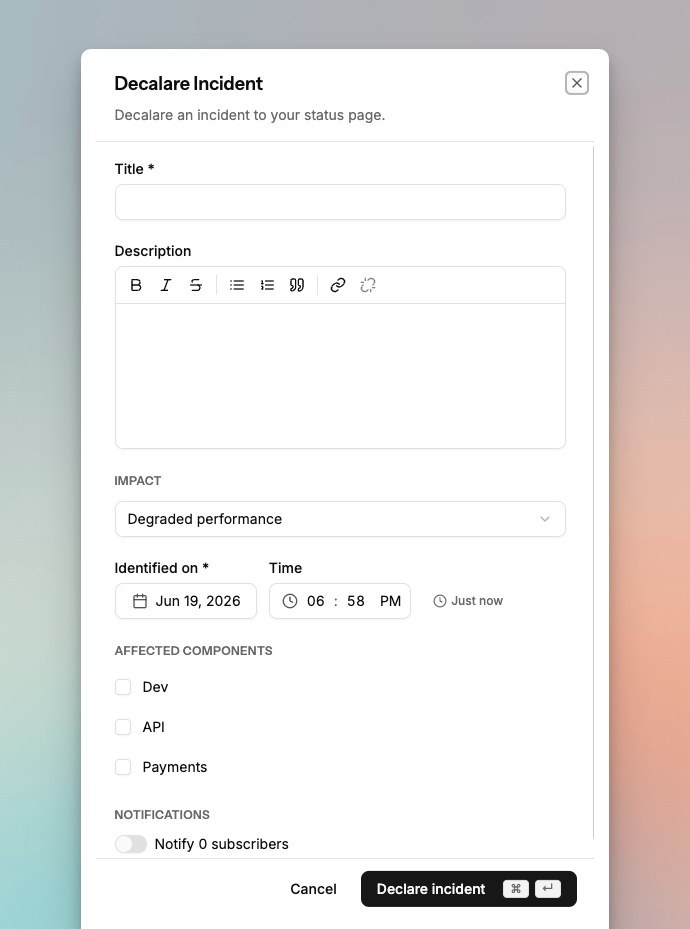
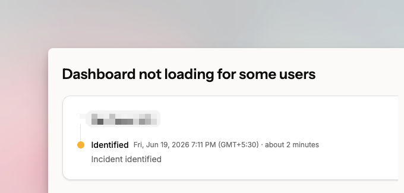
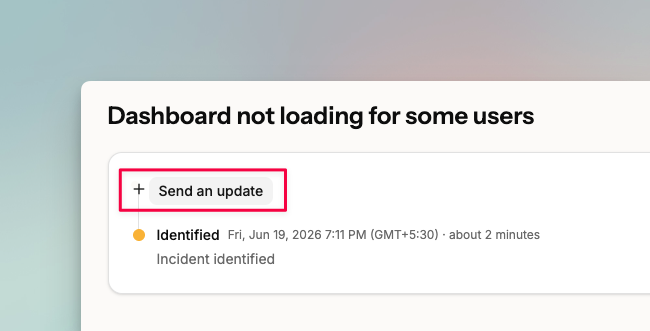
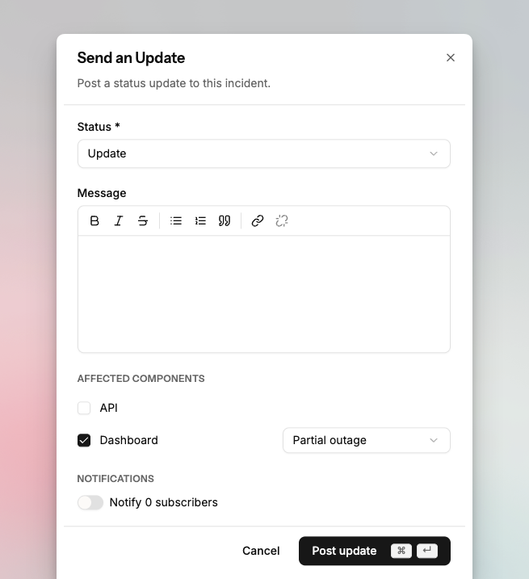
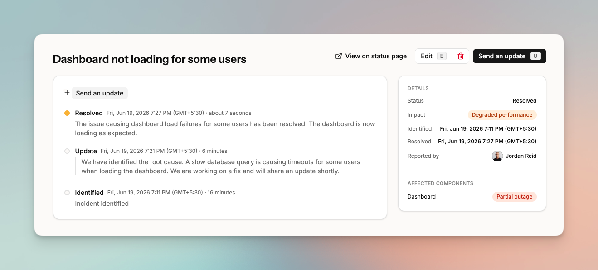

# Incidents on your status page

Use the status page dashboard to create public incidents and keep customers informed as the situation develops.

## Declare an incident

On your status page, click **Incidents** in the left sidebar, then click **Declare incident**.

<figure><figcaption></figcaption></figure>

Fill in the **title** and **description** to describe the issue.

Set the **impact** based on your assessment. You can update this as the situation develops.

Set the **date and time** the incident was identified. Spike uses this to calculate outage duration for affected components.

Select the **affected components** impacted by the incident. For each component, set its current state:

- **Operational**: The component is functioning correctly.
- **Degraded performance**: The component is working but below normal performance.
- **Partial outage**: The component is not working for some users or in some situations.
- **Critical outage**: The component is not functioning for most users.
- **Planned maintenance**: The component has scheduled maintenance. Consider creating a [Planned Maintenance event](create-planned-maintenance-on-status-page.md) instead.

To **notify subscribers** by email, toggle on the notification option. Spike sends an email to all status page subscribers.

## Add updates to an incident

Once the incident is created, it appears on your status page. Click into the incident to open it.

<figure><figcaption></figcaption></figure>

As you learn more, post updates to keep subscribers informed. Click **Send an update**.

<figure><figcaption></figcaption></figure>

<figure><figcaption></figcaption></figure>

For each update, select the current incident status:

- **Identified**: You have identified the cause or the fix.
- **Resolved**: The issue is fixed. Move affected components back to Operational.
- **Postmortem**: The issue is resolved. Use this to share findings and steps to prevent recurrence.
- **Update**: A general update when none of the above statuses apply.

<figure><figcaption></figcaption></figure>

Updates appear on your public status page immediately after posting.
