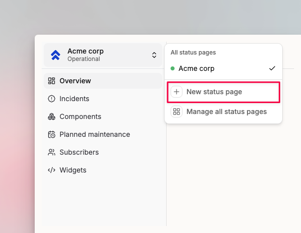
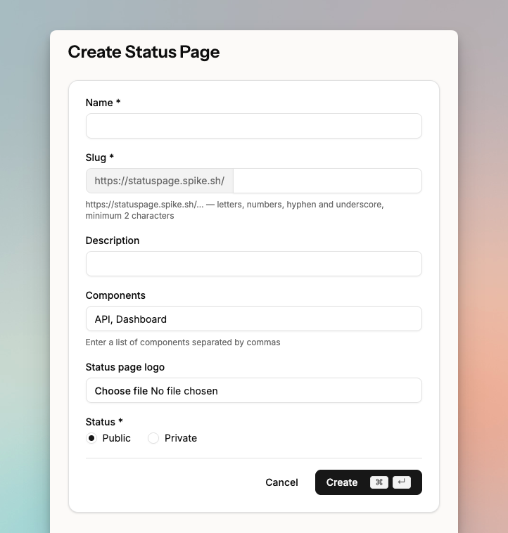
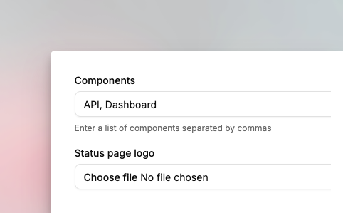
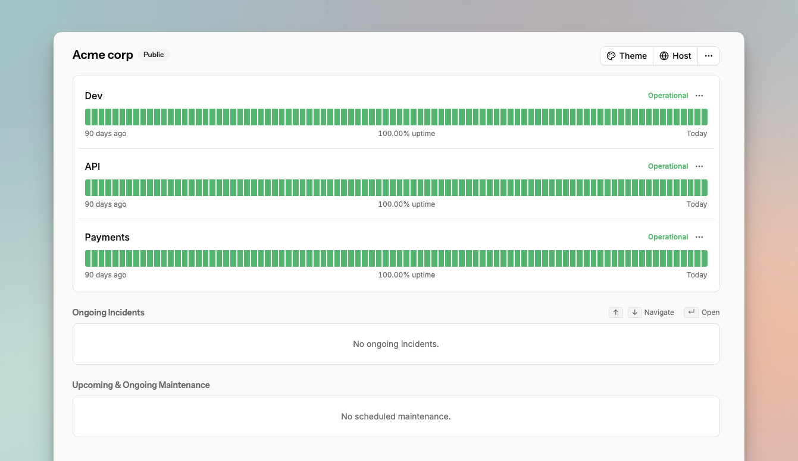

# Create a status page

A status page is a public-facing page that shows the current status of your system components: website, API, mobile app, or any service your customers depend on.

To create one, open the Status Pages dashboard and click **New status page** from the dropdown in the top navigation.

<figure><figcaption></figcaption></figure>

## Fill in the details

<figure><figcaption></figcaption></figure>

Fill in the name and description. The slug you set here becomes the URL where your status page is publicly accessible at `https://statuspage.spike.sh/your-slug`.

Upload a logo so customers can identify the page as yours.

Set the visibility to **Public** to make the page accessible to anyone with the link.

## Add components

Components represent the parts of your system you want to display status for — website, API, mobile app, or individual microservices. Enter them as a comma-separated list.

<figure><figcaption></figcaption></figure>

Once created, your status page appears in the dashboard with uptime history for each component.

<figure><figcaption>
Your status page in the dashboard.
</figcaption></figure>


Next, [style your status page](style-your-status-page.md) with your brand colors, or [add a custom domain](add-custom-domain-to-status-page.md).

