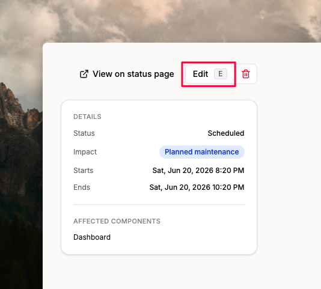
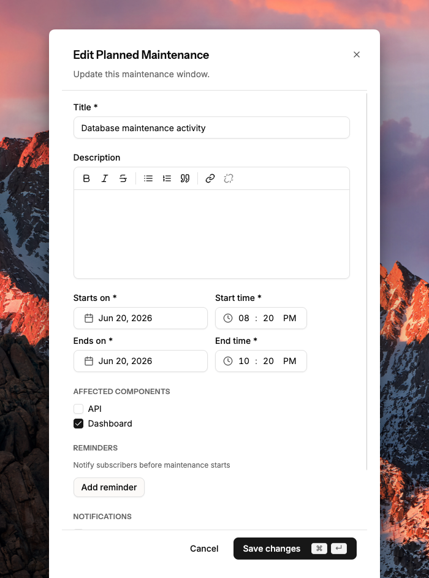

# Edit planned maintenance

On the planned maintenance details page, click **Edit** in the top-right corner.

<figure><figcaption></figcaption></figure>

You can update any field — title, description, affected components, start and end time.

<figure><figcaption></figcaption></figure>
