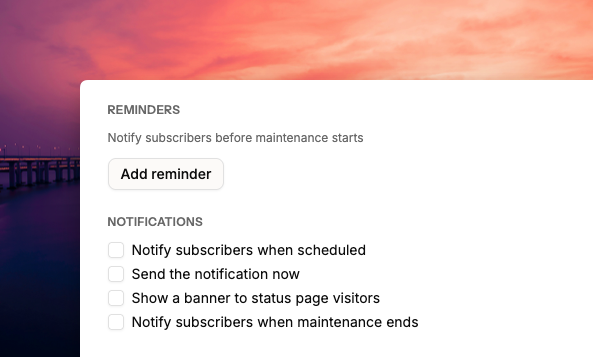

# Embed status page notifications on your website

The embed feature displays live status notifications directly on your website. Visitors see updates without having to visit your status page separately.

<figure><figcaption></figcaption></figure>

## When notifications appear

After page load completes, the notification appears within 5 seconds. By default, it shows in the bottom-right corner. You can configure the position in your widget settings.


Notifications support planned maintenance events and are shown once per visitor.


## Set up

Visit the **Widgets** section from the sidebar. Copy the code snippet and paste it before the closing `</body>` tag on every page where you want the notification to appear.

When creating or editing a planned maintenance event, enable **Show a banner to status page visitors**.

<figure><figcaption></figcaption></figure>

## Security

Add your domains to the allowlist so the widget loads correctly. Use `*.example.com` to allow all subdomains. For local testing, add your testing domain (such as an [ngrok](https://ngrok.com) URL) to the allowlist temporarily.