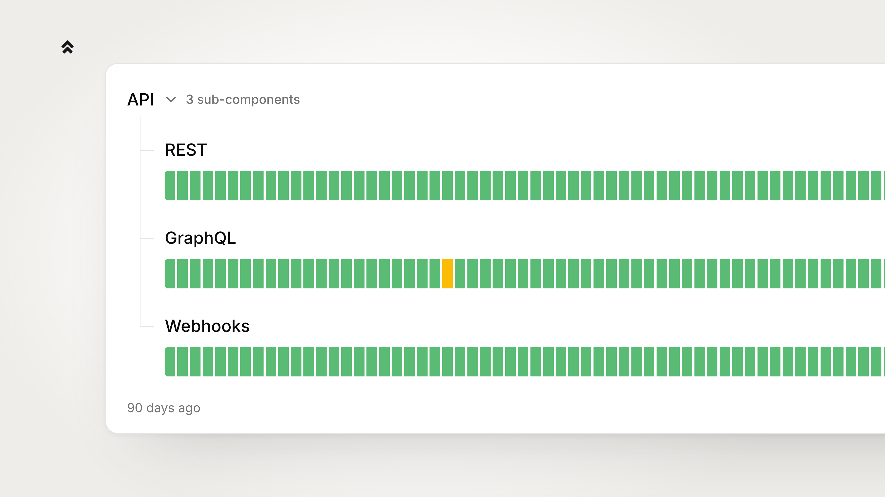
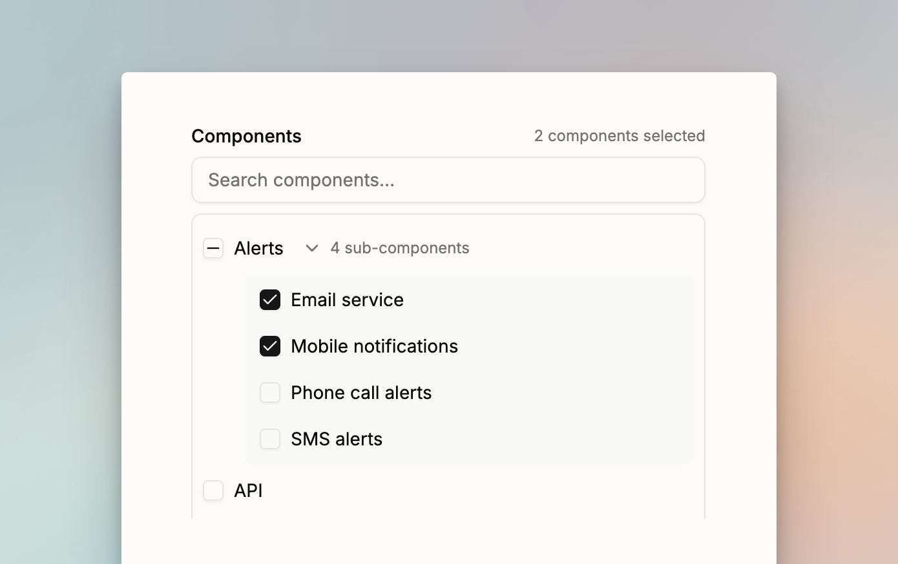

# Group components into nested components

Grouping components gives you fewer rows to scan, and a group's status tells you at a glance whether anything inside it is unhealthy. Put "India" and "Japan" under "Asia", or "SMS", "Slack" and "Phone" under "Alerting". These are called **nested components**.

<figure><figcaption></figcaption></figure>

Nesting is exactly one level deep. A component that is nested cannot contain anything itself, so the dashboard only ever offers top-level components as parents.

## Nest a component

Open the component's edit dialog and pick a **Parent component** from the dropdown. The dropdown lists only top-level components.

To keep a component at the top level, leave the dropdown on **No parent (top level)**.

If the component you are editing already has components nested under it, the dropdown is replaced by a line telling you to move or remove those first.

## Reorder and move components on the list

On the components list, nested components appear as indented rows under their parent. Expand and collapse a parent to show or hide them.

Each row's menu offers:

- **Make top-level**: moves a nested component out of its group.
- **Move under…**: moves a component into a group.
- **Move up** / **Move down**: changes the component's position.

You can also drag rows to reorder them. Reordering happens within a group: top-level components reorder among themselves, and nested components reorder inside their parent.

## How a parent's status is derived

A parent's status is derived, never set by hand. It shows the worst status among itself and everything nested under it, from least to most severe:

1. **Operational**
2. **Planned maintenance**
3. **Degraded performance**
4. **Partial outage**
5. **Critical outage**

So a parent whose child is in a partial outage shows a partial outage, even if the parent itself is fine.

The parent's 90-day uptime graph folds in its nested components' bars the same way — each day shows the worst state across the group.

## Select a group when you declare an incident

When you [declare an incident](create-public-incident-on-status-page.md), the affected-components picker is a tree with a search box. The search filters both levels, and a matching nested component keeps its parent visible.

<figure><figcaption></figcaption></figure>

Ticking a parent is a shortcut that selects everything nested under it, and unticking it clears them. When only some of a parent's children are selected, the parent shows a partial tick. You still set a status for each selected component.

## What visitors see

On the public status page, nested components are grouped under their parent behind a **Show nested components** / **Hide nested components** toggle that shows how many there are. Visitors can toggle any group themselves.

A group starts expanded when the parent's status is anything other than operational, so nothing is hidden on a bad day, and starts collapsed when everything in it is healthy.

Subscriber notification emails group the affected components under their parent and note how many nested components were affected.

## Archive a parent component

A component that still has components nested under it cannot be archived. Spike refuses and tells you to move or archive the nested components first.


Next, [style your status page](style-your-status-page.md) to choose which components show historical uptime, or [declare an incident](create-public-incident-on-status-page.md) against a group.

