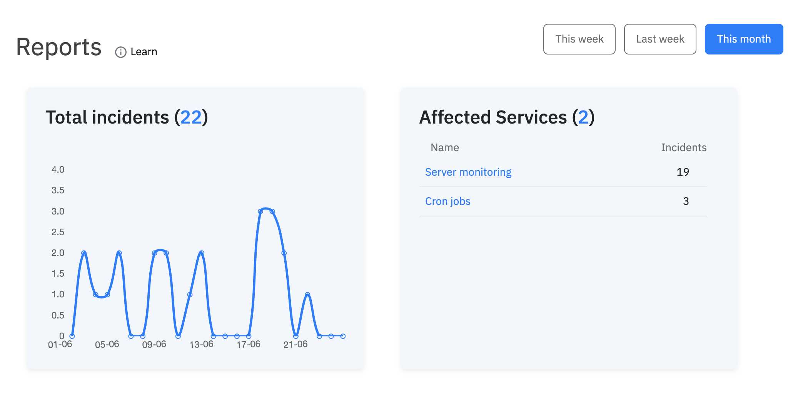

# What is Spike.sh?

Spike.sh is a simple incident management platform. We help you by alerting the right team members about incidents that affect your customer. 

## Focusing on simplicity

Spike.sh's mission is to reduce the complexity of managing incidents and make it simple so teams of all sizes use it. 

**Our platform consists of 5 main parts -**

1. Integrations
2. Services
3. Escalations
4. Alerts
5. Reports


To get in depth, please reach out to us at [demo@spike.sh](mailto:demo@spike.sh) or book a call directly on our [calendar](https://spike.sh/demo). 


### Integrations



We integrate with a number of services and tools so you can use Spike as a central intelligence as we gather incidents and alert the right person for each incident. You can add unlimited number of integrations to your account. Each integration would have a separate identifiable token so you needn't worry about incidents mixing up and rest knowing that we have got you covered.

We recently released Quick Setup for integrations. You can add new integrations to already existing services in just 10 seconds.


We have a growing [list of integrations](https://spike.sh/integrations). If you don't see an integration you need then email us at [integrations@spike.sh](mailto:integrations@spike.sh) and we will build it for you.


### Services

**You can think of services as a microservice.** Services are a way to scope your internal services from your architecture. Each of your service can have multiple integrations and you can create unlimited number of services. We highly encourage you to create different services for each of your different modules.

You can create services by just adding a name to it. No other field is required. With the power of unlimited services, you can create a blueprint of your entire architecture on Spike. This way, we will tell which service is affected and what is the current health status in terms of open incidents.

### Escalations

We provide simplicity by un-complicating escalation policies by allowing you to choose your alert channels. Anyone from your team can create escalation policies you can easily use. With the power of unlimited escalations, you can create escalations policies just for your self or one for your team and one for every team in your organization.

### Reports

No matter the size of your team, we believe everyone should have access to reports to bring in transparency to know how your platform measures in terms of open incidents. **We provide graphs to get a sense of total incidents, new incidents and repeated incidents for a given time period.**

~~**We provide you reports for number of incidents, Mean Time To Resolve \(MTTR\), Mean Time to Acknowledge \(MTTA\) segregated by each service and aggregated for the entire platform across multiple timelines.**~~

_A new version of MTTR and MTTA is coming soon._ We noticed none of our customers cared about MTTR and MTTA.. so we cut them out for a fresh new reports version and will continue to improve it. 

