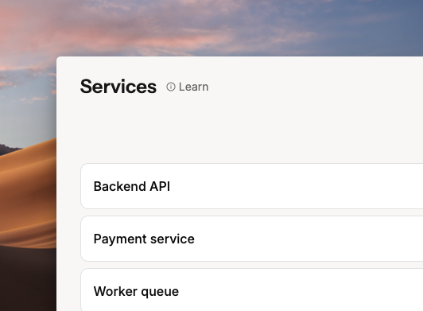
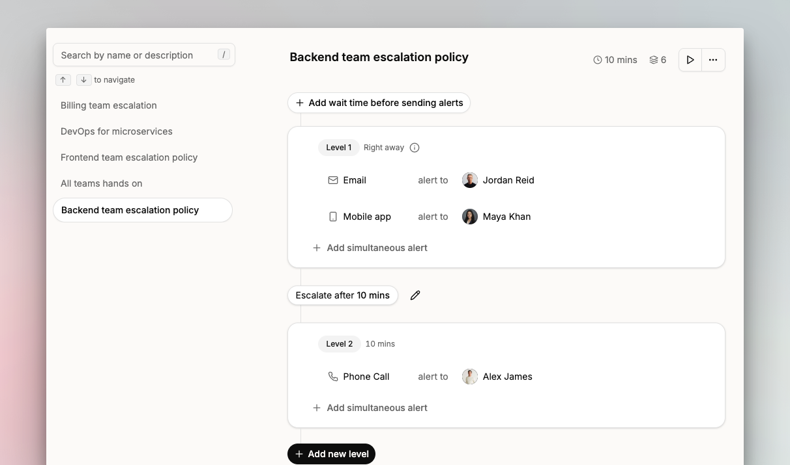

# What is Spike.sh?

Spike is an incident management platform. Connect your monitoring tools, define who gets paged and how, and Spike handles alerting when incidents fire.

## How Spike works

Every incident starts with an integration. When a connected monitoring tool detects a problem, it sends a signal to Spike. Spike creates an incident and triggers your escalation policy, which determines who gets notified and through which channel. If no one responds in time, Spike moves to the next person in line. Once resolved, reports capture the data so your team can track patterns over time.

## Core modules

### Integrations

Spike connects to [over 100 monitoring, logging, and observability tools](integrations-guideline/setup-integrations.md). Each integration gets a unique token, so incidents from different sources stay separate. You can add as many integrations as you need with no restrictions.


Don't see an integration you need? Email [integrations@spike.sh](mailto:integrations@spike.sh) and we'll build it.


### Services

<figure><figcaption>
Services map to components in your infrastructure.
</figcaption></figure>

Services map to components in your infrastructure: a backend API, a payment service, a worker queue. Each service holds multiple integrations. When an incident fires, Spike shows which service is affected and its current health status based on open incidents. You can create as many services as you need to reflect your full architecture.

### Escalations

<figure><figcaption>
Create separate escalation policies for teams, services, or situations.
</figcaption></figure>

An [escalation policy](escalations/introduction-to-escalations.md) defines who gets paged and in what order. You can build separate policies for different teams or services. If the first person doesn't acknowledge in time, Spike moves down the policy until someone responds.

### Alerts

Spike reaches your team through phone calls, SMS, email, Slack, Microsoft Teams, WhatsApp, Telegram, Discord, and Pushover. Each person sets their own alert preferences. [Alert rules](alerts/alert-rules.md) let you route, filter, and prioritize alerts automatically based on incident properties.

### On-call schedules

[On-call schedules](oncall-schedules/introduction-to-on-call-schedules.md) control who is on-call at any given time. Build schedules with layers and slots, set up overrides for coverage gaps, and sync shifts to Google Calendar, Apple Calendar, or Outlook.

### Playbooks

[Playbooks](playbooks/introduction-to-playbooks.md) automate the repetitive work that happens when an incident fires. Create a war room, open a Jira ticket, update your status page. Playbooks run these steps automatically so your team can focus on the fix.


To see Spike in action, book a call at [calendly.com/spikehq](https://calendly.com/spikehq) or email [demo@spike.sh](mailto:demo@spike.sh).

